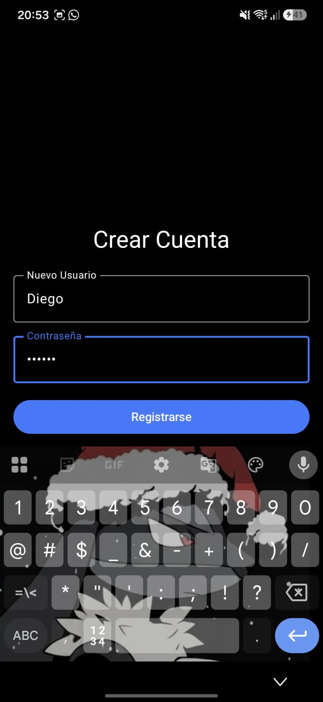
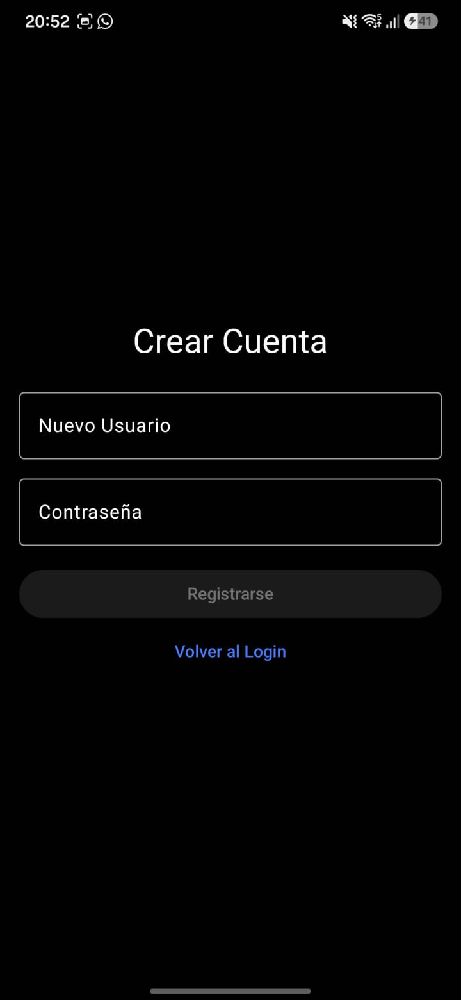
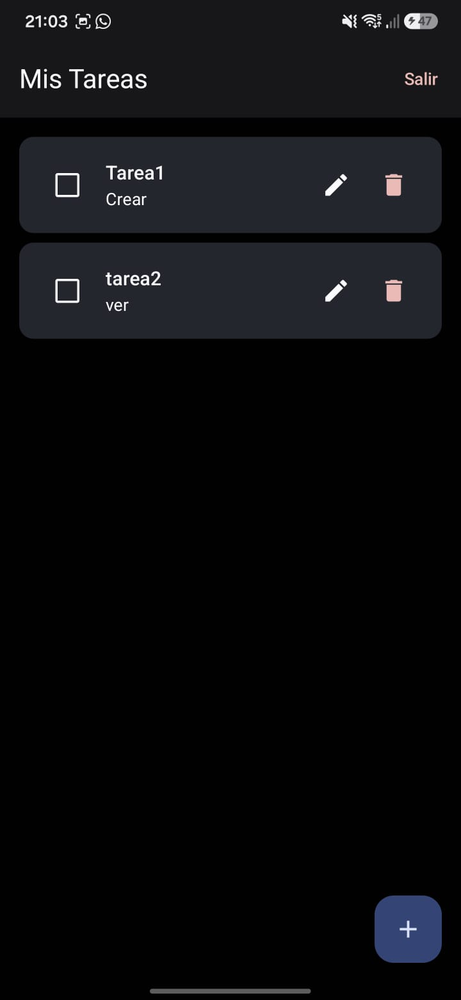
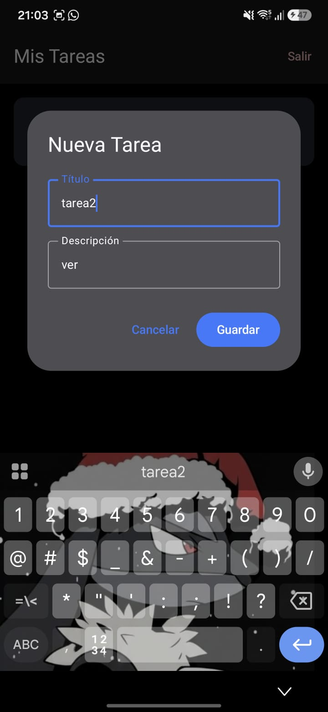
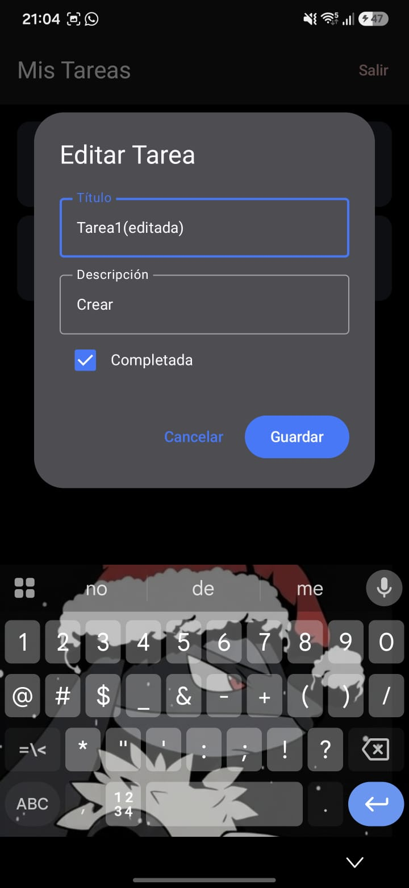
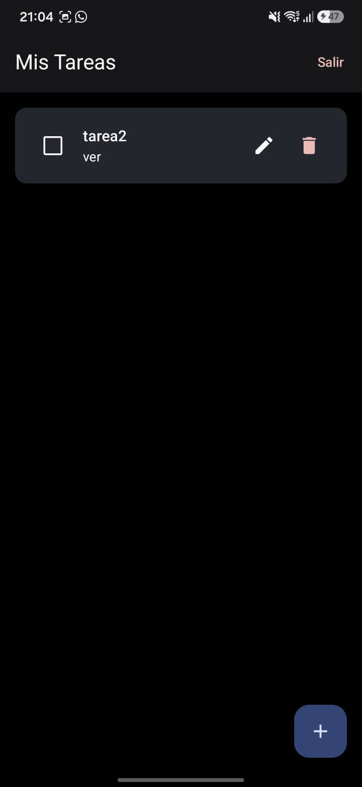

# Práctica 2 — Aplicación móvil básica para operaciones CRUD con un servicio REST

## Portada

**Alumno:** Diego Mendieta González
**Boleta:** 2024630077
**Grupo:** 7CV4
**Asignatura:** Desarrollo de Aplicaciones Móviles Nativas
**Profesor:** Gabriel Hurtado Aviles
**Fecha de entrega:** 18 de septiembre de 2026

---

# 1. Introducción

El objetivo de esta práctica es desarrollar una aplicación móvil capaz de comunicarse con un servicio REST para realizar operaciones CRUD (Crear, Leer, Actualizar y Borrar), además de implementar un sistema de registro e inicio de sesión de usuarios.

El proyecto está compuesto por dos partes principales:

1. Una **aplicación móvil Android**, desarrollada con Kotlin y Jetpack Compose.
2. Un **servicio REST**, desarrollado con Python y Flask, ejecutado dentro de un contenedor Docker.

La aplicación móvil funciona como cliente del servicio REST. El usuario puede registrarse, iniciar sesión y, una vez autenticado, administrar sus tareas mediante las operaciones CRUD.

La comunicación entre la aplicación y el backend se realiza mediante solicitudes HTTP utilizando Retrofit y OkHttp. El backend responde utilizando JSON y utiliza JWT para controlar las sesiones autenticadas.

Para la persistencia se utiliza SQLite mediante Flask-SQLAlchemy. Las contraseñas se almacenan utilizando un hash generado con Flask-Bcrypt, evitando almacenarlas directamente como texto plano.

El proyecto parte del repositorio de ejemplo proporcionado para la práctica:

`https://github.com/gabrielhuav/Flask-Compose-Login-API`

El repositorio de ejemplo fue utilizado como punto de partida para la estructura inicial del backend y de la aplicación Android. Sobre esa base se implementó la conexión real entre ambas partes, autenticación mediante JWT y las operaciones CRUD para el recurso de tareas.

---

# 2. Tecnologías utilizadas

## Aplicación móvil

* Kotlin
* Android
* Jetpack Compose
* Material 3
* Navigation Compose
* Retrofit
* Gson
* OkHttp
* ViewModel
* Android SDK

### Versiones principales

* Kotlin: 2.2.10
* Android Gradle Plugin: 9.3.2
* Compile SDK: 37
* Target SDK: 37
* Min SDK: 24
* Java: 11
* Navigation Compose: 2.7.7
* Lifecycle ViewModel Compose: 2.8.2
* Retrofit: 2.9.0
* Gson Converter: 2.9.0
* OkHttp Logging Interceptor: 4.12.0

## Backend

* Python 3.9
* Flask
* Flask-SQLAlchemy
* Flask-Bcrypt
* PyJWT
* SQLite

## Contenedores

* Docker
* Docker Compose

---

# 3. Arquitectura del proyecto

La aplicación utiliza una arquitectura cliente-servidor.

* Aplicación móvil: Registro / Login, Operaciones CRUD
* HTTP: API REST, Flask, Autenticacion, Endpoints Crud, validacion
* Base de Datos

El backend se ejecuta dentro de Docker y expone el puerto `5000`.

La aplicación Android utiliza Retrofit para consumir los endpoints disponibles en Flask.

---

# 4. Estructura general del proyecto

La estructura principal del repositorio está organizada de la siguiente manera:

```text
Practica2/
│
├── app/
│   └── src/
│       ├── androidTest/
│       ├── main/
│       │   ├── java/
│       │   │   └── dmendieta2005/
│       │   │       └── ...
│       │   │           ├── AppViewModel.kt
│       │   │           ├── MainActivity.kt
│       │   │           ├── network/
│       │   │           │   ├── ApiService.kt
│       │   │           │   ├── Models.kt
│       │   │           │   └── RetrofitClient.kt
│       │   │           └── ui/
│       │   │               └── theme/
│       │   └── res/
│       └── test/
│
├── Flask-Compose-Login-API/
│   ├── Android/
│   │   └── FlaskLogin/
│   │
│   └── Docker-Flask/
│       └── ORM/
│           ├── app.py
│           ├── Dockerfile
│           ├── docker-compose.yml
│           ├── requirements.txt
│           ├── .env.example
│           └── instance/
│
├── build.gradle.kts
├── settings.gradle.kts
├── gradle.properties
├── gradle/
├── gradlew
├── gradlew.bat
├── .gitignore
└── README.md
```

La carpeta de Android contiene la aplicación móvil utilizada para la práctica. El backend se encuentra en `Flask-Compose-Login-API/Docker-Flask/ORM`.

---

# 5. Desarrollo

## 5.1 Aplicación móvil

La aplicación fue desarrollada utilizando Kotlin y Jetpack Compose.

La interfaz está dividida principalmente en tres pantallas:

* Inicio de sesión.
* Registro de usuario.
* Administración de tareas.

La navegación permite pasar del inicio de sesión al registro y, después de autenticarse correctamente, acceder a las tareas.

La aplicación también maneja diferentes estados de la interfaz, como carga, errores y sesión iniciada.

---

## 5.2 Inicio de sesión

La pantalla de inicio de sesión solicita:

* Nombre de usuario.
* Contraseña.

Los datos se envían al endpoint:

```http
POST /login
```

Cuando las credenciales son correctas, el backend devuelve un JWT.

La aplicación conserva el token durante la sesión de la aplicación y posteriormente lo utiliza para realizar las operaciones protegidas.

---

## 5.3 Registro

La pantalla de registro permite crear un nuevo usuario proporcionando:

* Nombre de usuario.
* Contraseña.

La solicitud se realiza mediante:

```http
POST /register
```

El backend valida los datos recibidos y genera un hash de la contraseña mediante Flask-Bcrypt antes de almacenarla.

---

## 5.4 Administración de tareas

Después de iniciar sesión, el usuario puede administrar sus tareas.

Cada tarea contiene:

* `id`
* `title`
* `description`
* `completed`
* `user_id`

Las operaciones disponibles son:

* Crear una tarea.
* Consultar todas las tareas.
* Consultar una tarea individual.
* Modificar una tarea.
* Eliminar una tarea.
* Cambiar el estado de completada.

Las operaciones están asociadas al usuario autenticado.

---

# 6. Backend REST

El backend está desarrollado con Flask y utiliza Flask-SQLAlchemy como ORM.

El servicio se ejecuta en el puerto:

```text
5000
```

La ruta raíz permite verificar que el servicio está funcionando:

```http
GET /
```

Respuesta:

```json
{
  "message": "API funcionando"
}
```

---

# 7. Conceptos de Docker

## 7.1 Docker

Docker permite empaquetar la aplicación junto con sus dependencias y configuración dentro de un contenedor.

En este proyecto permite ejecutar el backend Flask de una forma reproducible sin instalar directamente todas las dependencias de Python en el equipo anfitrión.

---

## 7.2 Imagen y contenedor

Una **imagen** contiene la plantilla necesaria para ejecutar la aplicación.

Un **contenedor** es una instancia de esa imagen en ejecución.

En este proyecto, Docker construye una imagen a partir del `Dockerfile` y posteriormente ejecuta el backend Flask dentro del contenedor.

---

## 7.3 Dockerfile

El `Dockerfile` utiliza:

```dockerfile
FROM python:3.9-slim
```

como imagen base.

Posteriormente establece `/app` como directorio de trabajo, copia `requirements.txt`, instala las dependencias, copia el código de la aplicación y expone el puerto `5000`.

Finalmente ejecuta:

```dockerfile
CMD ["python", "app.py"]
```

---

## 7.4 Docker Compose

El archivo `docker-compose.yml` define el servicio del backend.

El contenedor utilizado es:

```text
flask_crud_backend
```

y el puerto se publica como:

```text
5000:5000
```

También se utiliza un volumen denominado:

```text
sqlite_data
```

para conservar los datos de SQLite.

---

# 8. API REST

## 8.1 GET /

Comprueba que la API se encuentra funcionando.

### Método

```http
GET /
```

### Autenticación

No requiere autenticación.

### Respuesta

```json
{
  "message": "API funcionando"
}
```

### Código HTTP

```text
200 OK
```

---

# 9. Registro de usuarios

## POST /register

Permite registrar un nuevo usuario.

### Método

```http
POST /register
```

### Body

```json
{
  "username": "diego",
  "password": "123456"
}
```

### Respuesta exitosa

```json
{
  "message": "Usuario creado exitosamente"
}
```

### Código HTTP

```text
201 Created
```

### Validaciones

El backend verifica:

* Que `username` sea obligatorio.
* Que `password` sea obligatoria.
* Que la contraseña tenga al menos 6 caracteres.
* Que el usuario no exista previamente.

La contraseña no se almacena directamente. Antes de guardar el usuario se genera un hash mediante Flask-Bcrypt.

---

# 10. Inicio de sesión

## POST /login

Permite autenticar un usuario existente.

### Método

```http
POST /login
```

### Body

```json
{
  "username": "diego",
  "password": "123456"
}
```

### Respuesta exitosa

```json
{
  "status": "success",
  "message": "Login exitoso",
  "user_id": 1,
  "username": "diego",
  "token": "JWT"
}
```

El valor real del JWT no se incluye en esta documentación.

### Código HTTP

```text
200 OK
```

### Credenciales incorrectas

Si las credenciales no son válidas:

```text
401 Unauthorized
```

Respuesta:

```json
{
  "status": "error",
  "message": "Credenciales inválidas"
}
```

---

# 11. Autenticación mediante JWT

Después de iniciar sesión, el backend genera un token JWT.

El token contiene información relacionada con el usuario autenticado y una fecha de expiración.

El algoritmo utilizado es:

```text
HS256
```

La duración configurada del token es de:

```text
2 horas
```

Las operaciones de tareas requieren enviar el token mediante el encabezado:

```http
Authorization: Bearer <token>
```

Los tokens reales no se incluyen en el README.

---

# 12. CRUD de tareas

Todas las operaciones CRUD de tareas requieren autenticación.

## 12.1 Crear tarea

### POST /tasks

Crea una nueva tarea asociada al usuario autenticado.

### Body

```json
{
  "title": "Mi primera tarea",
  "description": "Probar el CRUD de Flask",
  "completed": false
}
```

### Respuesta

```json
{
  "completed": false,
  "description": "Probar el CRUD de Flask",
  "id": 1,
  "title": "Mi primera tarea"
}
```

### Código

```text
201 Created
```

---

## 12.2 Obtener todas las tareas

### GET /tasks

Obtiene las tareas correspondientes al usuario autenticado.

### Encabezado

```http
Authorization: Bearer <token>
```

### Respuesta

```json
[
  {
    "completed": false,
    "description": "Probar el CRUD de Flask",
    "id": 1,
    "title": "Mi primera tarea"
  }
]
```

### Código

```text
200 OK
```

---

## 12.3 Obtener una tarea

### GET /tasks/{id}

Permite consultar una tarea específica.

Ejemplo:

```http
GET /tasks/1
```

### Encabezado

```http
Authorization: Bearer <token>
```

### Respuesta

```json
{
  "completed": false,
  "description": "Probar el CRUD de Flask",
  "id": 1,
  "title": "Mi primera tarea"
}
```

### Código

```text
200 OK
```

Si la tarea no existe o no pertenece al usuario autenticado:

```text
404 Not Found
```

---

## 12.4 Actualizar una tarea

### PUT /tasks/{id}

Actualiza una tarea existente.

Ejemplo:

```http
PUT /tasks/1
```

### Body

```json
{
  "title": "Mi primera tarea",
  "description": "CRUD probado correctamente",
  "completed": true
}
```

### Código

```text
200 OK
```

---

## 12.5 Eliminar una tarea

### DELETE /tasks/{id}

Elimina una tarea existente.

Ejemplo:

```http
DELETE /tasks/1
```

### Encabezado

```http
Authorization: Bearer <token>
```

### Respuesta

```json
{
  "message": "Tarea eliminada"
}
```

### Código

```text
200 OK
```

---

# 13. Códigos de respuesta utilizados

| Código | Significado                             |
| ------ | --------------------------------------- |
| `200`  | Operación realizada correctamente       |
| `201`  | Recurso creado correctamente            |
| `400`  | Datos enviados incorrectamente          |
| `401`  | No autenticado o credenciales inválidas |
| `404`  | Recurso no encontrado                   |

---

# 14. Base de datos

El proyecto utiliza:

```text
SQLite
```

mediante:

```text
Flask-SQLAlchemy
```

La configuración utiliza:

```python
sqlite:///site.db
```

## Modelo User

El modelo `User` contiene:

| Campo      | Tipo    |
| ---------- | ------- |
| `id`       | Integer |
| `username` | String  |
| `password` | String  |

Un usuario puede tener múltiples tareas.

## Modelo Task

El modelo `Task` contiene:

| Campo         | Tipo    |
| ------------- | ------- |
| `id`          | Integer |
| `title`       | String  |
| `description` | String  |
| `completed`   | Boolean |
| `user_id`     | Integer |

`user_id` funciona como llave foránea hacia el usuario propietario de la tarea.

---

# 15. Seguridad

La práctica requiere que las contraseñas no se almacenen en texto plano y que los endpoints que modifican o consultan información estén protegidos.

## Contraseñas

Las contraseñas son procesadas utilizando:

```text
Flask-Bcrypt
```

Para generar el hash:

```python
bcrypt.generate_password_hash(password)
```

Para comprobar una contraseña:

```python
bcrypt.check_password_hash(user.password, password)
```

Por lo tanto, la contraseña original no se almacena directamente en la base de datos.

## Protección de endpoints

Los endpoints `/tasks` requieren un JWT válido.

Si no se proporciona el token:

```text
401 Unauthorized
```

con una respuesta como:

```json
{
  "message": "Token requerido"
}
```

También se valida la expiración y validez del token.

## Separación de información por usuario

Las consultas de tareas utilizan el usuario autenticado:

```text
user_id=user.id
```

De esta forma, las tareas están asociadas a su propietario.

## Variables de entorno

La clave utilizada para firmar los JWT se obtiene mediante una variable de entorno:

```text
SECRET_KEY
```

El archivo `.env` no debe publicarse en GitHub.

El repositorio incluye `.env.example` como referencia para conocer el nombre de la variable necesaria.

No se incluyen en este README:

* contraseñas reales;
* tokens JWT;
* claves secretas;
* archivos `.env`;
* credenciales personales.

---

# 16. Instalación

## Requisitos

Para ejecutar el backend se necesita:

* Git
* Docker Desktop
* Docker Compose

Para ejecutar la aplicación móvil se necesita:

* Android Studio
* Android SDK
* un emulador Android o dispositivo físico compatible

---

# 17. Clonar el repositorio

Clonar el repositorio desde GitHub:

```bash
git clone URL_DEL_REPOSITORIO
```

Entrar en el proyecto:

```bash
cd Practica2
```

---

# 18. Configuración del backend

Entrar a la carpeta del backend:

```bash
cd Flask-Compose-Login-API/Docker-Flask/ORM
```

Crear un archivo `.env` a partir de `.env.example`.

La variable necesaria es:

```text
SECRET_KEY
```

Debe utilizarse una clave secreta propia y suficientemente larga.

El archivo `.env` es únicamente para el entorno local y no debe subirse al repositorio.

---

# 19. Ejecución con Docker Compose

Desde la carpeta:

```text
Flask-Compose-Login-API/Docker-Flask/ORM
```

ejecutar:

```bash
docker compose up --build
```

Docker construirá la imagen del backend e iniciará el contenedor.

El servicio quedará disponible en:

```text
http://localhost:5000
```

Para comprobar que el backend funciona se puede abrir:

```text
http://localhost:5000/
```

La respuesta esperada es:

```json
{
  "message": "API funcionando"
}
```

Para detener el servicio:

```bash
docker compose down
```

---

# 20. Ejecución de la aplicación Android

Abrir el proyecto Android desde Android Studio.

La aplicación utiliza Retrofit para comunicarse con el backend.

La URL base configurada actualmente para la comunicación con el servicio es:

```text
http://192.168.1.13:5000/
```

Esta dirección corresponde a la dirección local utilizada durante las pruebas.

Si se utiliza el emulador estándar de Android, la dirección habitual para acceder al `localhost` de la computadora anfitriona es:

```text
http://10.0.2.2:5000/
```

Si se utiliza un dispositivo físico conectado a la misma red, se debe utilizar la dirección IP local de la computadora donde está ejecutándose Docker.

La práctica establece esta diferencia entre emulador y dispositivo físico, por lo que la dirección debe ajustarse al entorno donde se ejecute el proyecto.

---

# 21. Flujo de funcionamiento

El flujo principal de la aplicación es:

```text
1. Abrir aplicación
       ↓
2. Registro de usuario
       ↓
3. Inicio de sesión
       ↓
4. Backend valida credenciales
       ↓
5. Backend genera JWT
       ↓
6. Aplicación recibe el JWT
       ↓
7. Aplicación solicita las tareas
       ↓
8. Usuario crea / consulta / modifica / elimina tareas
       ↓
9. Backend valida el JWT
       ↓
10. SQLite almacena los cambios
```

---

# 22. QA y pruebas realizadas

Se realizaron pruebas directamente contra el backend ejecutándose mediante Docker.

## Prueba 1 — Comprobación de API

Solicitud:

```http
GET /
```

Resultado:

```text
200 OK
```

Respuesta:

```json
{
  "message": "API funcionando"
}
```

---

## Prueba 2 — Registro

Solicitud:

```http
POST /register
```

Resultado:

```text
201 Created
```

Respuesta:

```json
{
  "message": "Usuario creado exitosamente"
}
```

---

## Prueba 3 — Inicio de sesión

Solicitud:

```http
POST /login
```

Resultado:

```text
200 OK
```

El backend devolvió correctamente un JWT.

El token utilizado durante las pruebas no se incluye en el repositorio.

---

## Prueba 4 — Acceso sin autenticación

Solicitud:

```http
GET /tasks
```

sin encabezado de autorización.

Resultado:

```text
401 Unauthorized
```

Respuesta:

```json
{
  "message": "Token requerido"
}
```

Esto demuestra que el endpoint CRUD está protegido.

---

## Prueba 5 — Consulta autenticada

Solicitud:

```http
GET /tasks
```

con:

```http
Authorization: Bearer <token>
```

Resultado:

```text
200 OK
```

Inicialmente la respuesta fue:

```json
[]
```

---

## Prueba 6 — Crear tarea

Solicitud:

```http
POST /tasks
```

Resultado:

```text
201 Created
```

Se creó correctamente una tarea.

---

## Prueba 7 — Consultar tarea

Solicitud:

```http
GET /tasks/1
```

Resultado:

```text
200 OK
```

La tarea creada fue recuperada correctamente.

---

## Prueba 8 — Actualizar tarea

Solicitud:

```http
PUT /tasks/1
```

Se modificaron los datos de la tarea y su estado `completed`.

Resultado:

```text
200 OK
```

---

## Prueba 9 — Verificar actualización

Solicitud:

```http
GET /tasks/1
```

Resultado:

```text
200 OK
```

Los datos actualizados fueron devueltos correctamente.

---

## Prueba 10 — Eliminar tarea

Solicitud:

```http
DELETE /tasks/1
```

Resultado:

```text
200 OK
```

Respuesta:

```json
{
  "message": "Tarea eliminada"
}
```

---

## Prueba 11 — Verificar eliminación

Solicitud:

```http
GET /tasks
```

Resultado:

```text
200 OK
```

Respuesta:

```json
[]
```

---

## Prueba 12 — Credenciales incorrectas

Se realizó un intento de inicio de sesión utilizando credenciales incorrectas.

Resultado:

```text
401 Unauthorized
```

Esto demuestra que el backend rechaza credenciales inválidas.

---

# 23. Evidencias y capturas de pantalla

Las evidencias de la práctica deben almacenarse dentro del repositorio y enlazarse desde este README.

Se recomienda organizar las capturas de la siguiente manera:

```text
docs/
├── registro.png
├── login.png
├── login-error.png
├── tareas.png
├── crear-tarea.png
├── consultar-tarea.png
├── actualizar-tarea.png
├── eliminar-tarea.png
└── docker.png
```

## Registro

Captura correspondiente al registro de un nuevo usuario.

```text

```

## Inicio de sesión

Captura correspondiente al inicio de sesión exitoso.

```text

```

## Lista de tareas

Captura de la pantalla principal después de iniciar sesión.

```text

```

## Crear tarea

Captura del proceso de creación de una tarea.

```text

```
```

## Actualizar tarea

Captura de una tarea después de modificar sus datos.

```text

```

## Eliminar tarea

Captura que demuestre la eliminación de una tarea.

```text

```

## Docker

Captura de Docker Compose ejecutando correctamente el backend.

```text

```

---

# 24. Decisiones técnicas

## Kotlin y Jetpack Compose

Se utilizó Kotlin debido a que es un lenguaje ampliamente utilizado para el desarrollo moderno de aplicaciones Android.

Jetpack Compose permite construir la interfaz mediante componentes declarativos y facilita el manejo de los diferentes estados de la aplicación.

## Retrofit

Retrofit se utiliza como cliente HTTP para consumir la API REST desde Android.

Permite declarar los endpoints mediante interfaces y convertir las respuestas JSON en objetos utilizados por la aplicación.

## Flask

Flask fue utilizado para implementar el servicio REST debido a que permite construir una API ligera y sencilla de mantener.

## SQLite

SQLite es suficiente para las necesidades de esta práctica porque permite almacenar la información de usuarios y tareas sin depender de un servidor de base de datos externo.

## Docker Compose

Docker Compose permite levantar el backend mediante un único comando y proporciona un entorno reproducible para la ejecución de la API.

## JWT

JWT permite representar la sesión autenticada mediante un token firmado con tiempo de expiración.

---

# 25. Uso del repositorio de ejemplo

La práctica proporciona como punto de partida el repositorio:

```text
https://github.com/gabrielhuav/Flask-Compose-Login-API
```

Este repositorio contiene una implementación inicial de un backend Flask dockerizado y una aplicación Android de referencia.

El proyecto de esta práctica utiliza esa base como referencia, pero se realizaron implementaciones adicionales para cumplir con el alcance solicitado.

Entre las funcionalidades implementadas se encuentran:

* Integración real entre Android y Flask.
* Registro de usuarios.
* Inicio de sesión.
* Generación y validación de JWT.
* Protección de endpoints.
* CRUD completo de tareas.
* Asociación de tareas con usuarios.
* Interfaz Android para administrar tareas.
* Comunicación mediante Retrofit.
* Ejecución del backend mediante Docker Compose.

El repositorio de ejemplo no debe confundirse con el repositorio personal utilizado para la entrega de esta práctica.

---

# 26. Conclusiones

Durante el desarrollo de esta práctica se integraron diferentes tecnologías para construir una aplicación móvil capaz de consumir un servicio REST.

Uno de los principales retos fue conectar correctamente la aplicación Android con el backend ejecutándose dentro de Docker. Fue necesario considerar que la dirección `localhost` desde un emulador Android no representa directamente a la computadora anfitriona, por lo que la dirección de conexión depende del entorno utilizado.

Otro aspecto importante fue implementar el sistema de autenticación. El backend utiliza Flask-Bcrypt para generar hashes de las contraseñas y PyJWT para generar tokens de sesión. Las rutas correspondientes a las tareas requieren un token válido antes de permitir las operaciones.

La implementación del CRUD permitió integrar todas las operaciones principales de una API REST: creación mediante `POST`, consulta mediante `GET`, actualización mediante `PUT` y eliminación mediante `DELETE`.

También se trabajó con Docker Compose para que el backend pudiera ejecutarse de manera reproducible, incluyendo sus dependencias y la persistencia de SQLite mediante un volumen.

Finalmente, las pruebas realizadas permitieron comprobar el funcionamiento del registro, inicio de sesión, protección de endpoints y operaciones CRUD.

La práctica permitió integrar conceptos de desarrollo móvil, servicios REST, autenticación, persistencia, Docker y comunicación cliente-servidor dentro de un mismo proyecto.

---

# 27. Bibliografía

Android Developers. (2026). *Jetpack Compose*. https://developer.android.com/develop/ui/compose

Android Developers. (2026). *Navigation with Compose*. https://developer.android.com/develop/ui/compose/navigation

Android Developers. (2026). *Connect to the network*. https://developer.android.com/develop/connectivity/network-ops/connecting

Docker. (2026). *Docker documentation*. https://docs.docker.com/

Docker. (2026). *Docker Compose documentation*. https://docs.docker.com/compose/

Flask. (2026). *Flask documentation*. https://flask.palletsprojects.com/

Flask-SQLAlchemy. (2026). *Flask-SQLAlchemy documentation*. https://flask-sqlalchemy.palletsprojects.com/

Kotlin. (2026). *Kotlin documentation*. https://kotlinlang.org/docs/home.html

OkHttp. (2026). *OkHttp documentation*. https://square.github.io/okhttp/

PyJWT. (2026). *PyJWT documentation*. https://pyjwt.readthedocs.io/

Retrofit. (2026). *Retrofit documentation*. https://square.github.io/retrofit/

---

# 28. Referencia del repositorio utilizado como punto de partida

Huav, G. (s. f.). *Flask-Compose-Login-API* [Repositorio de GitHub]. GitHub. https://github.com/gabrielhuav/Flask-Compose-Login-API
